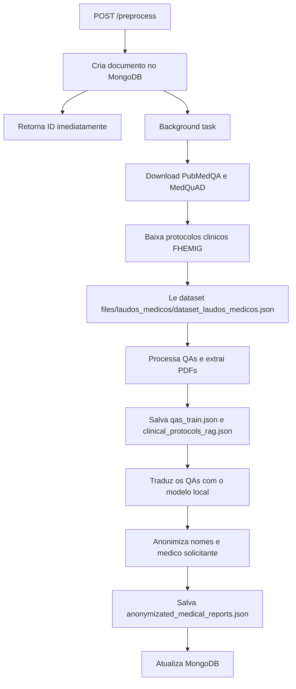

# FIAP POS IA - Backend

API REST em FastAPI responsavel pelo pre-processamento dos datasets medicos e geracao da base RAG. O fine-tuning do modelo e executado exclusivamente no Google Colab pelos notebooks versionados no repositorio, devido as limitacoes de hardware local.

- QAs, a partir de PubMedQA e MedQuAD;
- protocolos clinicos FHEMIG e PCDT, com extracao de texto dos PDFs;
- laudos medicos estruturados e sintaticos, usados como base de conhecimento;
- traducao dos QAs para pt-BR com um modelo local de machine translation;

O progresso de cada execucao e persistido no MongoDB.

## Sumario

- Visao geral
- Arquitetura
- Pre-requisitos
- Configuracao
- Como subir a aplicacao
- Endpoints da API
- Fluxo de preprocessamento
- Fluxo de RAG
- Estrutura do projeto
- Documentacao interativa

## Visao geral

O backend expoe endpoints para:

1. iniciar o pre-processamento dos datasets;
2. consultar o status de uma execucao em andamento ou concluida;
3. gerar a base RAG para uso futuro por um agente de IA;
4. realizar consultas semanticas por similaridade na base RAG;
5. verificar a saude da aplicacao.

Na inicializacao, a API testa a conexao com o MongoDB. Se a conexao falhar, a aplicacao nao sobe.

## Arquitetura

```text
src/
|-- main.py              # Ponto de entrada (uvicorn na porta 3000)
|-- server.py            # Factory da aplicacao FastAPI, CORS e lifespan
|-- routers/
|   |-- preprocess.py    # POST /preprocess, GET /preprocess/{id}
|   `-- rag_database.py  # POST /rag-database, POST /rag-database/query
|-- services/
|   |-- preprocess_data.py   # Logica de processamento em background
|   `-- rag_database.py      # Logica sincrona de geracao da base RAG
|   `-- preprocess/
|       `-- step_three_translation.py   # Traducao local dos QAs
`-- infra/
    `-- database/
        |-- mongodb.py           # Conexao singleton com MongoDB
        `-- collections/
            |-- preprocess.py    # CRUD da collection preprocess
            `-- rag_database.py  # CRUD das collections da base RAG

datasets/
|-- get_datasets.py      # Clone do PubMedQA/MedQuAD e download dos protocolos clinicos
|-- files/               # Datasets baixados em runtime
`-- preprocessed/        # Arquivos JSON gerados em runtime

models/
|-- hospital_helper/     # Modelo fine-tuned gerado
`-- hospital_helper_tokenizer/  # Tokenizer do modelo fine-tuned
```

O processamento pesado roda em background task do FastAPI. O endpoint POST /preprocess retorna imediatamente com o ID da execucao, e o cliente consulta o progresso via GET /preprocess/{id}.

Quando ha uma GPU Nvidia disponivel com driver/runtime configurados, o backend usa CUDA automaticamente para a etapa de traducao. Se nao houver GPU, ele faz fallback para CPU, o que deixa a traducao bem mais lenta.

## Pre-requisitos

| Requisito | Versao minima | Observacao                                    |
|-----------|---------------|-----------------------------------------------|
| Python    | 3.8+          | 3.9 recomendado                               |
| uv        | -             | Gerenciador de dependencias do projeto        |
| MongoDB   | 4.x+          | Obrigatorio para a API subir                  |
| Git       | -             | Necessario para clonar os datasets em runtime |

Para desenvolvimento local, tambem e util ter Docker e Docker Compose.

### Dependencias Python

Definidas em `pyproject.toml`:

| Pacote                     | Uso                                                      |
|----------------------------|----------------------------------------------------------|
| `fastapi`                  | Framework web                                            |
| `uvicorn[standard]`        | Servidor ASGI                                            |
| `pydantic`                 | Validacao de request/response                            |
| `python-dotenv`            | Carregamento de variaveis de ambiente                    |
| `pymongo`                  | Cliente MongoDB                                          |
| `requests`                 | Download dos protocolos clinicos                         |
| `beautifulsoup4`           | Parse do HTML com links dos PDFs                         |
| `pdfplumber`               | Extracao de texto dos PDFs                               |
| `transformers`             | Carregamento do modelo local de traducao                 |
| `torch`                    | Inferencia do modelo com suporte a CPU/GPU               |
| `sentencepiece`            | Tokenizacao usada pelo modelo de traducao                |
| `sacremoses`               | Pre e pos-processamento de texto para traducao           |
| `datasets`                 | Download e manipulacao dos datasets                      |
| `langchain-community`      | Embeddings usados na geracao RAG quando disponivel       |
| `langchain-text-splitters` | Chunking recursivo para protocolos clinicos              |

Dependencias de desenvolvimento: `pytest`, `black`, `mypy`.

## Configuracao

Copie o arquivo de exemplo e ajuste conforme seu ambiente:

```bash
cp .env.example .env
```

| Variavel                 | Descricao                                        | Padrao                       |
|--------------------------|--------------------------------------------------|------------------------------|
| `PYTHONPATH`             | Diretorio raiz dos modulos Python                | `src`                        |
| `MONGODB_USER`           | Usuario do MongoDB                               | `db_user`                    |
| `MONGODB_PASSWORD`       | Senha do MongoDB                                 | `db_pass`                    |
| `MONGODB_HOST`           | Host do MongoDB                                  | `localhost`                  |
| `MONGODB_PORT`           | Porta do MongoDB                                 | `27017`                      |
| `DB_NAME`                | Nome do banco de dados                           | `fiap_pos_ia_fase3`          |
| `RAG_EMBEDDING_MODEL`    | Modelo de embeddings para a base RAG             | `hkunlp/instructor-base`     |
| `HF_TOKEN`               | Token opcional para autenticacao no Hugging Face | -                            |

> Com Docker Compose, o host do MongoDB deve ser `mongodb`, nao `localhost`.

## Como subir a aplicacao

### Opcao 1 - Docker Compose

```bash
docker compose -f app-docker-compose.yaml up --build -d
```

O primeiro build pode demorar bastante porque a imagem do backend instala dependencias grandes de IA e, em ambientes Linux com GPU Nvidia, baixa tambem bibliotecas CUDA.

Para reiniciar os containers:

```bash
./restart-app.sh
```

### Opcao 2 - Apenas infraestrutura via Docker

```bash
docker compose -f infra-docker-compose.yaml up -d
```

Configure o `.env` com `MONGODB_HOST=localhost`.

### Opcao 3 - Desenvolvimento local

1. Suba o MongoDB localmente ou via Docker.
2. Instale as dependencias:

   ```bash
   cd backend
   uv sync
   ```

3. Execute a aplicacao:

   ```bash
   uv run python src/main.py
   ```

4. Verifique a API:

   ```bash
   curl http://localhost:3000/health
   ```

## Endpoints da API

### `GET /health`

Health check da aplicacao.

**Resposta:**

```json
{
  "app_name": "FIAP POS IA Backend",
  "timestamp": "2026-07-31T10:00:00.000000",
  "status": "UP"
}
```

### `POST /preprocess`

Inicia o pre-processamento dos datasets. O processamento roda em background; a resposta traz o documento criado no MongoDB.

**Body:**

| Campo              | Tipo   | Obrigatorio | Descricao                                                                     |
|--------------------|--------|-------------|-------------------------------------------------------------------------------|
| `skip_translation` | `bool` | Nao         | Pula a etapa de tradução usando dataset já traduzido e fixado (padrao: false) |

**Exemplo:**

```bash
curl -X POST http://localhost:3000/preprocess/ \
  -H "Content-Type: application/json" \
  -d '{"skip_translation": true}'
```

**Resposta:**

```json
{
  "id": "a1b2c3d4-e5f6-7890-abcd-ef1234567890",
  "steps": {
    "one_download_datasets": { "status": "pending", "error_message": null },
    "two_data_extraction": { "status": "pending", "error_message": null },
    "three_translating": { "status": "pending", "error_message": null }
  },
  "results": {
    "qas_train_path": null,
    "qas_train_pt_br_path": null,
    "clinical_protocols_rag_path": null,
    "qas_count": 0,
    "clinical_protocols_count": 0
  },
  "status": "created",
  "updated_date": "2026-07-31T10:00:00.000000+00:00",
  "completion_percentage": 0
}
```

Em caso de falha, o documento pode incluir `error_message` e o status pode mudar para `error` ou `failed`.

### `GET /preprocess/{doc_id}`

Consulta o status de uma execucao pelo ID.

**Resposta de exemplo:**

```json
{
  "id": "a1b2c3d4-e5f6-7890-abcd-ef1234567890",
  "steps": {
    "one_download_datasets": { "status": "completed" },
    "two_data_extraction": { "status": "completed" },
    "three_translating": { "status": "completed" }
  },
  "results": {
    "qas_train_path": "datasets/preprocessed/qas/qas_train.json",
    "qas_train_pt_br_path": "datasets/preprocessed/qas/qas_train_pt_br.json",
    "clinical_protocols_rag_path": "datasets/preprocessed/clinical_protocols/clinical_protocols_rag.json",
    "qas_count": 15234,
    "clinical_protocols_count": 120
  },
  "status": "completed",
  "updated_date": "2026-07-31T10:05:00.000000+00:00",
  "completion_percentage": 100
}
```

### `POST /rag-database`

Gera e persiste a base RAG a partir dos arquivos preprocessados existentes. A geracao agora e sincrona.

**Regras principais:**

1. o `preprocess_id` deve existir no MongoDB;
2. o preprocess precisa estar com status `completed`;
3. se nao existir, a API retorna `404`;
4. se existir mas nao estiver concluido, a API retorna `422`;
5. os documentos da base sao persistidos em `rag_documents`;
6. cada documento inclui `metadatas.source` para rastreabilidade de origem.

**Body:**

| Campo           | Tipo  | Obrigatorio | Descricao                        |
|-----------------|-------|-------------|----------------------------------|
| `preprocess_id` | `str` | Sim         | ID do preprocessamento concluido |

**Exemplo:**

```bash
curl -X POST http://localhost:3000/rag-database/ \
  -H "Content-Type: application/json" \
  -d '{"preprocess_id":"<id>"}'
```

**Resposta:**

```json
{
  "id": "3c3efdbb-4f8e-4d1c-8f4a-0c8d5a8b5e0d",
  "batch_id": "3c3efdbb-4f8e-4d1c-8f4a-0c8d5a8b5e0d",
  "preprocess_id": "<id>",
  "preprocess_snapshot": {
    "_id": "<id>",
    "status": "completed",
    "updated_date": "2026-08-13T10:00:00+00:00"
  },
  "qas_rag_path": "backend/datasets/preprocessed/qas/qas_train_pt_br.json",
  "clinical_protocols_rag_path": "backend/datasets/preprocessed/clinical_protocols/clinical_protocols_rag.json",
  "medical_reports_path": "backend/datasets/preprocessed/medical_reports/anonymizated_medical_reports.json",
  "embedding_model": "hkunlp/instructor-base",
  "splitter_name": "RecursiveCharacterTextSplitter",
  "splitter_chunk_size": 2400,
  "splitter_chunk_overlap": 200,
  "status": "completed",
  "error_message": null,
  "created_date": "2026-08-13T10:00:00+00:00",
  "updated_date": "2026-08-13T10:00:02+00:00",
  "qas_documents": 8703,
  "clinical_protocol_documents": 42,
  "medical_report_documents": 120,
  "total_documents": 8865
}
```

### `POST /rag-database/query`

Realiza a consulta por similaridade vetorial na base RAG. A rota recebe a query textual, gera o embedding da consulta, calcula a similaridade com os documentos persistidos no MongoDB e retorna os documentos mais relevantes ordenados por score.

**Body:**

| Campo                  | Tipo    | Obrigatorio | Descricao                                                                             |
|------------------------|---------|-------------|---------------------------------------------------------------------------------------|
| `query`                | `str`   | Sim         | Texto da consulta do usuario                                                          |
| `top_k`                | `int`   | Nao         | Quantidade maxima de documentos a retornar (padrao: 5, min: 1, max: 50)               |
| `preprocess_id`        | `str`   | Nao         | Filtro opcional para limitar a busca aos documentos de um preprocessamento especifico |
| `similarity_threshold` | `float` | Nao         | Score minimo de similaridade para filtrar os resultados (ex: 0.2)                     |

**Exemplo:**

```bash
curl -X POST http://localhost:3000/rag-database/query \
  -H "Content-Type: application/json" \
  -d '{"query": "como tratar tuberculose?", "top_k": 5}'
```

**Resposta:**

```json
{
  "query": "como tratar tuberculose?",
  "total_results": 1,
  "documents": [
    {
      "id": "f39ea3dd-0c0f-403f-a616-d601eaf27000-qas-002437",
      "preprocess_id": "a8c752bb-c270-436b-b9fd-1aaec5b1dcdb",
      "dataset": "qas",
      "source_type": "qas",
      "content": "### QAs RAG\nPergunta: Quais são os tratamentos da tuberculose pulmonar?\nResposta: O tratamento da tuberculose pulmonar é realizado com o esquema RIPE (Rifampicina, Isoniazida, Pirazinamida e Etambutol)...",
      "similarity_score": 0.372707,
      "metadatas": {
        "source": {
          "source": "PubMedQA",
          "url": "https://pubmed.ncbi.nlm.nih.gov/..."
        },
        "question": "Quais são os tratamentos da tuberculose pulmonar?",
        "answer": "O tratamento da tuberculose...",
        "contexts_count": 1
      },
      "chunk_index": null,
      "chunk_total": null
    }
  ]
}
```

### Estrutura do corpus RAG

Os documentos gravados em `rag_documents` seguem uma estrutura pensada para recuperacao e citacao:

- `content`: texto normalizado usado na indexacao;
- `dataset` / `source_type`: identifica se o documento veio de `qas`, `clinical_protocols` ou `medical_reports`;
- `embedding`: vetor gerado para recuperar o documento no futuro;
- `metadatas.source`: guarda a origem que o agente pode exibir ao responder.

Para `qas`, `metadatas.source` replica o objeto `metadata` original do dataset. Para `clinical_protocols`, `metadatas.source` contem `name`, `url` e `source`.

Para `medical_reports`, o texto e os metadados usam apenas os campos clinicos do laudo anonimizado. Identificadores do laudo, nome do paciente, medico solicitante e CRM nao sao indexados.

Se um protocolo for dividido em varios chunks, todos os chunks herdam a mesma `metadatas.source`, preservando a citacao do documento original.

### Observacao sobre consulta de status do RAG

O fluxo atual nao expoe mais `GET /rag-database/{doc_id}`. Como a geracao passou a ser sincrona, a resposta do `POST /rag-database/` ja traz o resumo final da execucao.

---

### Tecnicas Aplicadas a Consulta por Query no RAG

Para garantir a precisao da busca vetorial e contornar limitacoes de ambiente sem bibliotecas de deep learning pesadas instaladas, foram aplicadas as seguintes tecnicas:

#### 1. Fallback Semantico com Feature Hashing (256d) L2-Normalizado
- **Problema de vetores aleatorios**: Modelos de fallback ingênuos que usam SHA-256 de texto completo geram valores exclusivamente positivos $[0.0, 1.0]$. A Cosine Similarity entre vetores inteiramente positivos e sempre alta ($\approx 0.95 - 0.98$), fazendo com que documentos totalmente irrelevantes (ex: *"Rim Ectopico"*) aparecessem no topo de consultas sobre *"tuberculose"*.
- **Solucao**: O `_FallbackEmbeddingModel` utiliza **Feature Hashing (256 dimensões)** com sinais determinísticos ($\pm 1$) derivados do hash SHA-256 de cada token. Documentos com vocabulário diferente cancelam seus componentes no produto escalar, resultando em similaridade de cosseno $\approx 0.0$.
- **Normalizacao L2**: Todos os vetores gerados sao divididos por sua norma euclidiana ($\|\mathbf{v}\| = 1$), garantindo que a escala de magnitude do texto nao distorça o cálculo da similaridade de cosseno.

#### 2. Tokenizacao Especializada em Portugues e Stemming de Radicais
- **Remocao de acentuacao**: Normalização de texto via `unicodedata` NFD para ignorar acentos diacríticos (ex: *"hipertensão"* vs *"hipertensao"*).
- **Filtragem de Stopwords**: Remoção de palavras funcionais da língua portuguesa (`PT_STOPWORDS`), garantindo que conectivos e artigos nao influenciem o vetor de busca.
- **Stemming de Radicais (5 caracteres)**: Extração automática do prefixo inicial das palavras (ex: *"tratar"*, *"tratamento"*, *"tratamentos"* $\rightarrow$ radical `trata`), permitindo que variações gramaticais da mesma raiz semântica coincidam no espaço vetorial.
- **Bigramas**: Indexação de pares de palavras consecutivas para capturar o contexto de frases compostas.

#### 3. Pontuacao Hibrida (Hybrid Scoring)
- Quando o modelo de fallback está ativo, o sistema combina a **similaridade de cosseno** do vetor ($60\%$) com o **índice de sobreposição de palavras-chave da consulta** ($40\%$):
  $$\text{Score Final} = (0.6 \times \text{CosineSimilarity}) + (0.4 \times \text{KeywordOverlapRatio})$$
- Essa abordagem híbrida prioriza documentos que contêm os termos médicos centrais da pergunta do usuário.

#### 4. Recalculamento Dnamico de Embeddings Incompativeis ou Legados
- Para evitar a necessidade de reprocessar toda a base RAG no MongoDB quando a dimensão do vetor muda (ex: bases antigas de 16d ou alterações no modelo), o serviço `query_rag_documents` verifica a dimensão do vetor armazenado em cada documento.
- Caso ocorra divergência de dimensão entre a query e o documento no banco, o sistema recalcula dinamicamente o embedding do campo `content` usando o modelo ativo, garantindo consultas precisas instantaneamente.


## Fluxo de preprocessamento

Quando `POST /preprocess` e chamado, a sequencia em background e:



### Arquivos gerados

- `datasets/preprocessed/qas/qas_train.json`: registros combinados de PubMedQA e MedQuAD.
- `datasets/preprocessed/qas/qas_train_pt_br.json`: cópia traduzida dos QAs.
- `datasets/preprocessed/clinical_protocols/clinical_protocols_rag.json`: protocolos com texto extraído dos PDFs.
- `datasets/preprocessed/medical_reports/anonymizated_medical_reports.json`: laudos anonimizados gerados a partir de `datasets/files/laudos_medicos/dataset_laudos_medicos.json`.

### Laudos médicos e anonimização

O arquivo de entrada versionado fica em `backend/datasets/files/laudos_medicos/dataset_laudos_medicos.json`. No Step 4 (`services/preprocess/step_four_anonymization.py`), o backend lê a lista JSON, preserva a estrutura dos registros e mascara os campos pessoais do cabeçalho: `nome_paciente` recebe asteriscos na mesma extensão do valor original e `medico_solicitante` mantém o prefixo `Dr(a).` seguido por asteriscos.

O resultado é gravado em `backend/datasets/preprocessed/medical_reports/anonymizated_medical_reports.json` e seu caminho é salvo em `results.medical_reports_path`. Na geração da RAG, o serviço lê esse caminho, transforma os campos clínicos aninhados em texto, aplica o mesmo splitter recursivo, gera embeddings e persiste chunks em `rag_documents` com `dataset` e `source_type` iguais a `medical_reports`. `id_laudo`, `nome_paciente`, `medico_solicitante` e `crm_solicitante` ficam fora do conteúdo e dos metadados indexados.

Os registros de QA seguem `question`, `contexts`, `answer` e `metadata`. A etapa de tradução processa os itens em lotes de 16, divide textos longos em chunks de até 400 caracteres para evitar truncamento e preserva a estrutura e os metadados.

> **Integração RAG:** o pré-processamento produz `qas_train_pt_br.json`, mas o serviço `services/rag_database.py` ainda mantém `rag_pt_br.json` como caminho padrão. A geração da base RAG precisa receber o caminho atualizado ou ter esse default ajustado antes de ser usada após uma nova execução de pré-processamento.

### Step 3 - traducao local

A etapa de traducao usa localmente o modelo `Helsinki-NLP/opus-mt-tc-big-en-pt`, carregado por `transformers` e executado com `torch`.

- Se o backend encontrar uma GPU Nvidia disponivel, a inferencia roda em CUDA.
- Se nao encontrar GPU, o modelo roda em CPU, o que aumenta bastante o tempo de execucao.
- A tradução cobre `question`, todos os `contexts` textuais e `answer`; campos não textuais e `metadata` são preservados.
- **Aviso sobre a Tradução de QAs**: A tradução dos dados de QAs é extremamente demorada e não roda em todos os hardwares. Por isso, foi implementada a opção (`skip_translation`) de pular essa etapa e utilizar o dataset já traduzido que está fixado na pasta `backend/datasets/preprocessed/fixed/qas`.

## Estrutura do projeto

```text
backend/
|-- Dockerfile
|-- pyproject.toml
|-- uv.lock
|-- src/
`-- datasets/
    |-- get_datasets.py
    |-- files/
    `-- preprocessed/
```

## Documentacao interativa

Com a API rodando:

| URL                         | Descricao  |
|-----------------------------|------------|
| http://localhost:3000/docs  | Swagger UI |
| http://localhost:3000/redoc | ReDoc      |
