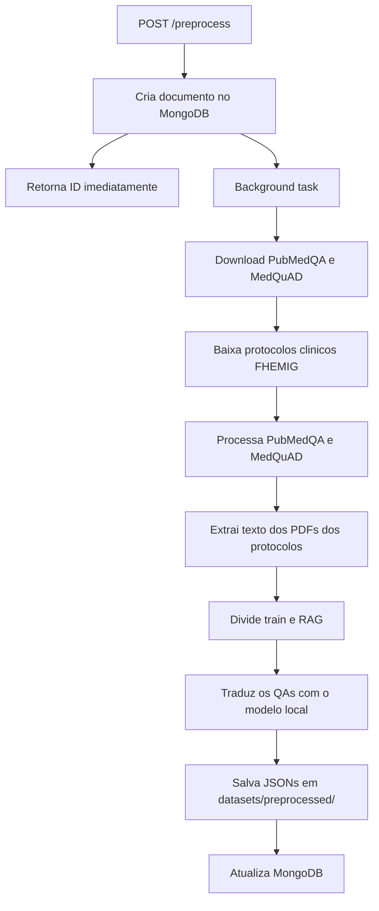

# FIAP POS IA - Backend

API REST em FastAPI responsavel pelo pre-processamento de datasets medicos. Hoje o fluxo trata duas familias de dados e uma etapa adicional de traducao local:

- QAs, a partir de PubMedQA e MedQuAD;
- protocolos clinicos FHEMIG, com extracao de texto dos PDFs.
- traducao dos QAs para pt-BR com um modelo local de machine translation.

O progresso de cada execucao e persistido no MongoDB.

## Sumario

- Visao geral
- Arquitetura
- Pre-requisitos
- Configuracao
- Como subir a aplicacao
- Endpoints da API
- Fluxo de preprocessamento
- Estrutura do projeto
- Documentacao interativa

## Visao geral

O backend expoe endpoints para:

1. iniciar o pre-processamento dos datasets;
2. consultar o status de uma execucao em andamento ou concluida;
3. verificar a saude da aplicacao.

Na inicializacao, a API testa a conexao com o MongoDB. Se a conexao falhar, a aplicacao nao sobe.

## Arquitetura

```text
src/
|-- main.py              # Ponto de entrada (uvicorn na porta 3000)
|-- server.py            # Factory da aplicacao FastAPI, CORS e lifespan
|-- routers/
|   `-- preprocess.py    # POST /preprocess, GET /preprocess/{id}
|-- services/
|   |-- preprocess_data.py   # Logica de processamento em background
|   `-- preprocess/
|       `-- step_three_translation.py   # Traducao local dos QAs
`-- infra/
    `-- database/
        |-- mongodb.py           # Conexao singleton com MongoDB
        `-- collections/
            `-- preprocess.py    # CRUD da collection preprocess

datasets/
|-- get_datasets.py      # Clone do PubMedQA/MedQuAD e download dos protocolos clinicos
|-- files/               # Datasets baixados em runtime
`-- preprocessed/        # Arquivos JSON gerados em runtime
```

O processamento pesado roda em background task do FastAPI. O endpoint POST /preprocess retorna imediatamente com o ID da execucao, e o cliente consulta o progresso via GET /preprocess/{id}.

Quando ha uma GPU Nvidia disponivel com driver/runtime configurados, o backend usa CUDA automaticamente para a etapa de traducao. Se nao houver GPU, ele faz fallback para CPU, o que deixa a traducao bem mais lenta.

## Pre-requisitos

| Requisito | Versao minima | Observacao |
|-----------|---------------|------------|
| Python | 3.8+ | 3.9 recomendado |
| uv | - | Gerenciador de dependencias do projeto |
| MongoDB | 4.x+ | Obrigatorio para a API subir |
| Git | - | Necessario para clonar os datasets em runtime |

Para desenvolvimento local, tambem e util ter Docker e Docker Compose.

### Dependencias Python

Definidas em `pyproject.toml`:

| Pacote | Uso |
|--------|-----|
| `fastapi` | Framework web |
| `uvicorn[standard]` | Servidor ASGI |
| `pydantic` | Validacao de request/response |
| `python-dotenv` | Carregamento de variaveis de ambiente |
| `pymongo` | Cliente MongoDB |
| `requests` | Download dos protocolos clinicos |
| `beautifulsoup4` | Parse do HTML com links dos PDFs |
| `pdfplumber` | Extracao de texto dos PDFs |
| `transformers` | Carregamento do modelo local de traducao |
| `torch` | Inferencia do modelo com suporte a CPU/GPU |
| `sentencepiece` | Tokenizacao usada pelo modelo de traducao |
| `sacremoses` | Pre e pos-processamento de texto para traducao |

Dependencias de desenvolvimento: `pytest`, `black`, `mypy`.

## Configuracao

Copie o arquivo de exemplo e ajuste conforme seu ambiente:

```bash
cp .env.example .env
```

| Variavel | Descricao | Padrao |
|----------|-----------|--------|
| `PYTHONPATH` | Diretorio raiz dos modulos Python | `src` |
| `MONGODB_USER` | Usuario do MongoDB | `db_user` |
| `MONGODB_PASSWORD` | Senha do MongoDB | `db_pass` |
| `MONGODB_HOST` | Host do MongoDB | `localhost` |
| `MONGODB_PORT` | Porta do MongoDB | `27017` |
| `DB_NAME` | Nome do banco de dados | `fiap_pos_ia_fase3` |

> Com Docker Compose, o host do MongoDB deve ser `mongodb`, nao `localhost`.

## Como subir a aplicacao

### Opcao 1 - Docker Compose

```bash
docker compose -f app-docker-compose.yaml up --build -d
```

O primeiro build pode demorar bastante porque a imagem do backend instala dependencias grandes de IA e, em ambientes Linux com GPU Nvidia, baixa tambem bibliotecas CUDA.

Para reiniciar os containers:

```bash
./restart-app.sh
```

### Opcao 2 - Apenas infraestrutura via Docker

```bash
docker compose -f infra-docker-compose.yaml up -d
```

Configure o `.env` com `MONGODB_HOST=localhost`.

### Opcao 3 - Desenvolvimento local

1. Suba o MongoDB localmente ou via Docker.
2. Instale as dependencias:

   ```bash
   cd backend
   uv sync
   ```

3. Execute a aplicacao:

   ```bash
   uv run python src/main.py
   ```

4. Verifique a API:

   ```bash
   curl http://localhost:3000/health
   ```

## Endpoints da API

### `GET /health`

Health check da aplicacao.

**Resposta:**

```json
{
  "app_name": "FIAP POS IA Backend",
  "timestamp": "2026-07-31T10:00:00.000000",
  "status": "UP"
}
```

### `POST /preprocess`

Inicia o pre-processamento dos datasets. O processamento roda em background; a resposta traz o documento criado no MongoDB.

**Body:**

| Campo | Tipo | Obrigatorio | Descricao |
|-------|------|-------------|-----------|
| `rag_percent` | `float` | Nao | Percentual destinado ao conjunto RAG (0.0 a 1.0). E aplicado tanto ao MedQuAD quanto aos protocolos clinicos. |

**Exemplo:**

```bash
curl -X POST http://localhost:3000/preprocess/ \
  -H "Content-Type: application/json" \
  -d '{"rag_percent": 0.5}'
```

**Resposta:**

```json
{
  "id": "a1b2c3d4-e5f6-7890-abcd-ef1234567890",
  "rag_percent": 0.5,
  "steps": {
    "one_download_datasets": { "status": "pending", "error_message": null },
    "step_two_data_extraction": { "status": "pending", "error_message": null }
  },
  "results": {
    "QAs": { "train_data": 0, "rag_data": 0 },
    "clinical_protocols": { "train_data": 0, "rag_data": 0 }
  },
  "status": "created",
  "updated_date": "2026-07-31T10:00:00.000000+00:00",
  "completion_percentage": 0
}
```

Em caso de falha, o documento pode incluir `error_message` e o status pode mudar para `error` ou `failed`.

### `GET /preprocess/{doc_id}`

Consulta o status de uma execucao pelo ID.

**Resposta de exemplo:**

```json
{
  "id": "a1b2c3d4-e5f6-7890-abcd-ef1234567890",
  "rag_percent": 0.5,
  "steps": {
    "one_download_datasets": { "status": "completed" },
    "step_two_data_extraction": { "status": "completed" }
  },
  "results": {
    "QAs": { "train_data": 15234, "rag_data": 8765 },
    "clinical_protocols": { "train_data": 120, "rag_data": 40 }
  },
  "status": "completed",
  "updated_date": "2026-07-31T10:05:00.000000+00:00",
  "completion_percentage": 100
}
```

### `POST /fine-tunning`

Inicia o fine tuning do modelo `hospital_helper` a partir de um `preprocess_id` ja concluido.

**Regras principais:**

1. o `preprocess_id` deve existir no MongoDB;
2. o preprocess precisa estar com status `completed`;
3. se nao existir, a API retorna `404`;
4. se existir mas nao estiver concluido, a API retorna `422`;
5. o treino usa GPU quando disponivel e CPU como fallback.

**Body:**

| Campo | Tipo | Obrigatorio | Descricao |
|-------|------|-------------|-----------|
| `preprocess_id` | `str` | Sim | ID do preprocessamento anterior |
| `base_model_name` | `str` | Nao | Override opcional do modelo base |
| `include_clinical_protocols` | `bool` | Nao | Inclui protocolos clinicos no treino |
| `use_4bit` | `bool` | Nao | Habilita 4-bit quando o ambiente suportar |

**Exemplo:**

```bash
curl -X POST http://localhost:3000/fine-tunning/ \
  -H "Content-Type: application/json" \
  -d '{"preprocess_id":"<id>", "use_4bit": false}'
```

**Resposta:**

```json
{
  "preprocess_id": "<id>",
  "device": "cuda",
  "model_output_dir": "backend/models/hospital_helper",
  "tokenizer_output_dir": "backend/models/hospital_helper_tokenizer",
  "summary_path": "backend/models/hospital_helper/training_summary.json"
}
```

## Fluxo de preprocessamento

Quando `POST /preprocess` e chamado, a sequencia em background e:



### Regras de divisao dos dados

- PubMedQA vai 100% para `train.json`.
- MedQuAD e protocolos clinicos sao divididos conforme `rag_percent`.
- Os resultados sao salvos separadamente em:
  - `datasets/preprocessed/qas/`
  - `datasets/preprocessed/clinical_protocols/`

### Step 3 - traducao local

A etapa de traducao usa localmente o modelo `Helsinki-NLP/opus-mt-tc-big-en-pt`, carregado por `transformers` e executado com `torch`.

- Se o backend encontrar uma GPU Nvidia disponivel, a inferencia roda em CUDA.
- Se nao encontrar GPU, o modelo roda em CPU, o que aumenta bastante o tempo de execucao.
- Os arquivos traduzidos sao gerados com sufixo `_pt_br.json`.

## Estrutura do projeto

```text
backend/
|-- Dockerfile
|-- pyproject.toml
|-- uv.lock
|-- src/
`-- datasets/
    |-- get_datasets.py
    |-- files/
    `-- preprocessed/
```

## Documentacao interativa

Com a API rodando:

| URL | Descricao |
|-----|-----------|
| http://localhost:3000/docs | Swagger UI |
| http://localhost:3000/redoc | ReDoc |
