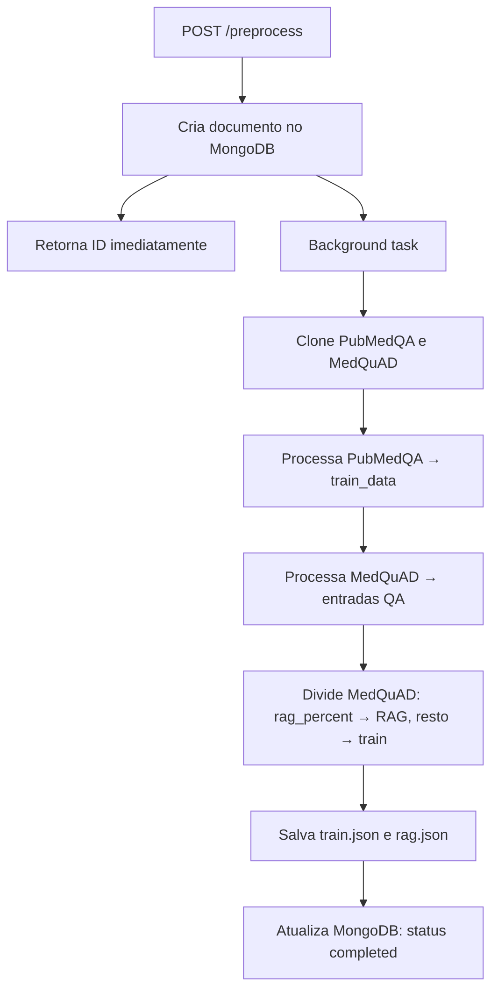

# FIAP POS IA — Backend

API REST em **FastAPI** responsável pelo pré-processamento de datasets médicos (**PubMedQA** e **MedQuAD**), separando os dados em conjuntos de treinamento e RAG (Retrieval-Augmented Generation). O progresso de cada execução é persistido no **MongoDB**.

## Sumário

- [Visão geral](#visão-geral)
- [Arquitetura](#arquitetura)
- [Pré-requisitos](#pré-requisitos)
- [Configuração](#configuração)
- [Como subir a aplicação](#como-subir-a-aplicação)
- [Endpoints da API](#endpoints-da-api)
- [Fluxo de pré-processamento](#fluxo-de-pré-processamento)
- [Estrutura do projeto](#estrutura-do-projeto)
- [Documentação interativa](#documentação-interativa)

---

## Visão geral

O backend expõe endpoints para:

1. **Iniciar o pré-processamento** dos datasets PubMedQA e MedQuAD, com divisão configurável entre dados de treino e RAG.
2. **Consultar o status** de uma execução em andamento ou concluída.
3. **Verificar a saúde** da aplicação.

Na inicialização, a API testa a conexão com o MongoDB. Se a conexão falhar, a aplicação **não sobe** — isso evita que requisições sejam aceitas sem persistência de dados.

---

## Arquitetura

```
src/
├── main.py              # Ponto de entrada (uvicorn na porta 3000)
├── server.py            # Factory da aplicação FastAPI, CORS e lifespan
├── routers/             # Rotas carregadas dinamicamente
│   └── preprocess.py    # POST /preprocess, GET /preprocess/{id}
├── services/
│   └── preprocess_data.py   # Lógica de processamento (background task)
└── infra/
    └── database/
        ├── mongodb.py           # Conexão singleton com MongoDB
        └── collections/
            └── preprocess.py    # CRUD da collection "preprocess"

datasets/
├── clone_datasets.py    # Clone dos repositórios PubMedQA e MedQuAD
├── files/               # Datasets clonados (gerado em runtime)
└── preprocessed/        # train.json e rag.json (gerado em runtime)
```

O processamento pesado roda em **background task** do FastAPI: o endpoint `POST /preprocess` retorna imediatamente com o ID da execução, e o cliente consulta o progresso via `GET /preprocess/{id}`.

---

## Pré-requisitos

| Requisito | Versão mínima | Observação |
|-----------|---------------|------------|
| Python | 3.8+ | 3.9 recomendado (usado no Docker) |
| [uv](https://docs.astral.sh/uv/) | — | Gerenciador de dependências do projeto |
| MongoDB | 4.x+ | Obrigatório para a API subir |
| Git | — | Necessário para clonar os datasets em runtime |

Para desenvolvimento local, também é útil ter **Docker** e **Docker Compose** (veja [Como subir a aplicação](#como-subir-a-aplicação)).

### Dependências Python

Definidas em `pyproject.toml`:

| Pacote | Uso |
|--------|-----|
| `fastapi` | Framework web |
| `uvicorn[standard]` | Servidor ASGI |
| `pydantic` | Validação de request/response |
| `python-dotenv` | Carregamento de variáveis de ambiente |
| `pymongo` | Cliente MongoDB |

Dependências de desenvolvimento (opcionais): `pytest`, `black`, `mypy`.

---

## Configuração

Copie o arquivo de exemplo e ajuste conforme seu ambiente:

```bash
cp .env.example .env
```

| Variável | Descrição | Padrão |
|----------|-----------|--------|
| `PYTHONPATH` | Diretório raiz dos módulos Python | `src` |
| `MONGODB_USER` | Usuário do MongoDB | `db_user` |
| `MONGODB_PASSWORD` | Senha do MongoDB | `db_pass` |
| `MONGODB_HOST` | Host do MongoDB | `localhost` |
| `MONGODB_PORT` | Porta do MongoDB | `27017` |
| `DB_NAME` | Nome do banco de dados | `fiap_pos_ia_fase3` |

> **Nota:** Com Docker Compose (`app-docker-compose.yaml`), o host do MongoDB deve ser `mongodb` (nome do serviço na rede interna), não `localhost`.

---

## Como subir a aplicação

### Opção 1 — Docker Compose (recomendado)

Na raiz do repositório, suba backend e MongoDB juntos:

```bash
docker compose -f app-docker-compose.yaml up --build -d
```

Para reiniciar os containers:

```bash
./restart-app.sh
```

A API ficará disponível em `http://localhost:3000`.

### Opção 2 — Apenas infraestrutura via Docker

Se preferir rodar o backend localmente e só o MongoDB em container:

```bash
docker compose -f infra-docker-compose.yaml up -d
```

Configure o `.env` com `MONGODB_HOST=localhost` e siga a opção 3.

### Opção 3 — Desenvolvimento local

1. Suba o MongoDB (local ou via `infra-docker-compose.yaml`).

2. Instale as dependências com **uv**:

   ```bash
   cd backend
   uv sync
   ```

3. Ative o ambiente virtual e execute:

   ```bash
   # Linux/macOS
   source .venv/bin/activate
   python src/main.py

   # Windows (PowerShell)
   .venv\Scripts\Activate.ps1
   python src/main.py
   ```

   Alternativamente, sem ativar o venv:

   ```bash
   uv run python src/main.py
   ```

4. Verifique se a API está no ar:

   ```bash
   curl http://localhost:3000/health
   ```

---

## Endpoints da API

### `GET /health`

Health check da aplicação.

**Resposta (200):**

```json
{
  "app_name": "FIAP POS IA Backend",
  "timestamp": "2026-07-30T22:42:00.000000",
  "status": "UP"
}
```

---

### `POST /preprocess`

Inicia o pré-processamento dos datasets. O processamento roda em background; a resposta traz o documento criado no MongoDB.

**Body (JSON):**

| Campo | Tipo | Obrigatório | Descrição |
|-------|------|-------------|-----------|
| `rag_percent` | `float` | Não | Percentual dos dados **MedQuAD** destinados ao conjunto RAG (0.0 a 1.0). Padrão: `0.5` |

**Exemplo de requisição:**

```bash
curl -X POST http://localhost:3000/preprocess/ \
  -H "Content-Type: application/json" \
  -d '{"rag_percent": 0.5}'
```

**Resposta (200):**

```json
{
  "id": "a1b2c3d4-e5f6-7890-abcd-ef1234567890",
  "train_data": 0,
  "rag_data": 0,
  "status": "created",
  "updated_date": "2026-07-30T22:42:00.000000+00:00",
  "completion_percentage": 0
}
```

Em caso de falha no processamento, o documento pode retornar:

```json
{
  "id": "a1b2c3d4-e5f6-7890-abcd-ef1234567890",
  "train_data": 0,
  "rag_data": 0,
  "status": "failed",
  "updated_date": "2026-07-30T22:42:00.000000+00:00",
  "completion_percentage": 0,
  "error_message": "Erro ao salvar arquivo rag.json: ..."
}
```

**Códigos de erro:**

| Código | Situação |
|--------|----------|
| 400 | `rag_percent` inválido |
| 404 | Dataset não encontrado após clone |
| 500 | Erro interno no processamento |

---

### `GET /preprocess/{doc_id}`

Consulta o status de uma execução pelo ID retornado no `POST /preprocess`.

**Exemplo:**

```bash
curl http://localhost:3000/preprocess/a1b2c3d4-e5f6-7890-abcd-ef1234567890
```

**Resposta (200):**

```json
{
  "id": "a1b2c3d4-e5f6-7890-abcd-ef1234567890",
  "train_data": 15234,
  "rag_data": 8765,
  "status": "completed",
  "updated_date": "2026-07-30T22:45:00.000000+00:00",
  "completion_percentage": 100
}
```

Quando a execução falha, o mesmo endpoint retorna o status `failed` e inclui o campo opcional `error_message` com a causa da falha.

**Valores possíveis de `status`:**

| Status | Significado |
|--------|-------------|
| `created` | Documento criado; processamento ainda não iniciou |
| `in_progress` | Processamento em andamento |
| `completed` | Processamento concluído (`completion_percentage` = 100) |
| `failed` | Processamento interrompido por erro; o campo `error_message` descreve a falha |

**Códigos de erro:**

| Código | Situação |
|--------|----------|
| 404 | Documento não encontrado |
| 500 | Erro ao consultar o MongoDB |

---

## Fluxo de pré-processamento

Quando `POST /preprocess` é chamado, a seguinte sequência ocorre em background:



**Regras de divisão dos dados:**

- **PubMedQA** — 100% vai para o conjunto de **treino** (`train.json`).
- **MedQuAD** — dividido conforme `rag_percent`:
  - Primeiros N% → conjunto **RAG** (`rag.json`)
  - Restante → conjunto de **treino** (`train.json`)

**Formato de saída** (`datasets/preprocessed/`):

```json
{
  "question": "Qual é o tratamento para...?",
  "contexts": ["contexto 1", "contexto 2"],
  "answer": "Resposta completa...",
  "metadata": {
    "source": "pubmedqa",
    "url": "https://pubmed.ncbi.nlm.nih.gov/12345678/"
  }
}
```

**Progresso reportado** (`completion_percentage`):

| Etapa | Percentual |
|-------|------------|
| PubMedQA processado | ~25% |
| MedQuAD processado | ~50% |
| Divisão train/RAG | ~75% |
| Arquivos salvos | 100% |

Os datasets são clonados automaticamente na primeira execução. Para detalhes sobre o download manual, consulte [`datasets/README.md`](datasets/README.md).

---

## Estrutura do projeto

```
backend/
├── Dockerfile
├── pyproject.toml          # Dependências e configuração do projeto
├── uv.lock                 # Lock file do uv
├── .env.example            # Template de variáveis de ambiente
├── src/
│   ├── main.py
│   ├── server.py
│   ├── routers/
│   ├── services/
│   └── infra/database/
└── datasets/
    ├── clone_datasets.py
    ├── files/              # Gerado em runtime
    └── preprocessed/       # Gerado em runtime
```

---

## Documentação interativa

Com a API rodando, acesse:

| URL | Descrição |
|-----|-----------|
| [http://localhost:3000/docs](http://localhost:3000/docs) | Swagger UI |
| [http://localhost:3000/redoc](http://localhost:3000/redoc) | ReDoc |

Ambas são geradas automaticamente pelo FastAPI a partir dos modelos Pydantic e docstrings dos endpoints.
