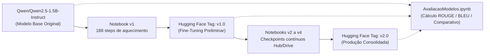

# Notebooks de Fine-Tuning e Avaliação de Modelos — Hospital Helper

Este diretório reúne os notebooks desenvolvidos e executados em ambiente **Google Colab** (com GPU NVIDIA T4/A100) para o treinamento (*fine-tuning*), execução de runtime e avaliação formal de desempenho do assistente médico da Fase 3 do Tech Challenge.

---

## 🧭 Guia Rápido dos Notebooks

| Notebook | Propósito | Tag no Hugging Face | Status |
|---|---|---|---|
| [`FineTunning.ipynb`](FIAP_PosTech_IA4Devs_Fase3_TechChallenge_FineTunning.ipynb) | Treinamento preliminar inicial (aquecimento de 188 steps) | `v1.0` | Histórico |
| [`FineTunning_v2.ipynb`](FIAP_PosTech_IA4Devs_Fase3_TechChallenge_FineTunning_v2.ipynb) | Treinamento com introdução de salvamento e recuperação de checkpoints | - | Histórico |
| [`FineTunning_v3.ipynb`](FIAP_PosTech_IA4Devs_Fase3_TechChallenge_FineTunning_v3.ipynb) | Treinamento com sincronização de checkpoints no Hugging Face Hub | - | Histórico |
| [`FineTunning_v4.ipynb`](FIAP_PosTech_IA4Devs_Fase3_TechChallenge_FineTunning_v4.ipynb) | **Treinamento canônico consolidado** (SFTTrainer, LoRA/PEFT, merge e upload) | `v2.0` | **Canônico (Treinamento)** |
| [`RuntimeModelo_01.ipynb`](FIAP_PosTech_IA4Devs_Fase3_TechChallenge_RuntimeModelo_01.ipynb) | Servidor FastAPI + ngrok para disponibilizar inferência do modelo | `v2.0` | Runtime / Demonstração |
| [`TestesValidacoes.ipynb`](FIAP_PosTech_IA4Devs_Fase3_TechChallenge_TestesValidacoes.ipynb) | Validação de conectividade e testes de contrato da API HTTP | - | Testes de API |
| [`AvaliacaoModelos.ipynb`](FIAP_PosTech_IA4Devs_Fase3_TechChallenge_AvaliacaoModelos.ipynb) | **Avaliação quantitativa e qualitativa com métricas formais (ROUGE, BLEU)** | Suporta `v1.0`, `v2.0` e Base | **Canônico (Avaliação - GAP02)** |

---

## 🧬 Linhagem e Versionamento dos Modelos no Hugging Face

O modelo treinado e seu versionamento estão hospedados publicamente no Hugging Face Hub:  
🔗 [**fiap-hospital-helper/hospital-helper-qwen2.5-1.5b**](https://huggingface.co/fiap-hospital-helper/hospital-helper-qwen2.5-1.5b)



1. **Modelo Base Original:** `Qwen/Qwen2.5-1.5B-Instruct`
   - Ponto de partida fundacional, sem adaptação ao vocabulário ou diretrizes clínicas brasileiras.
2. **Versão Preliminar (`tag: v1.0`):**
   - Gerada pelo notebook `FIAP_PosTech_IA4Devs_Fase3_TechChallenge_FineTunning.ipynb`.
   - Executou um ciclo curto de 188 steps de fine-tuning.
3. **Versão de Produção Consolidada (`tag: v2.0`):**
   - Treinada a partir da evolução iniciada no notebook `v2` e finalizada no `v4`.
   - Utilizou estratégia com `push_to_hub=True` para checkpoints periódicos, retomada automática em caso de timeout do Colab, fusão (*merge*) dos adaptadores LoRA e publicação no Hugging Face Hub.

---

## 🚀 Como Executar a Avaliação de Modelos no Google Colab

O notebook [`FIAP_PosTech_IA4Devs_Fase3_TechChallenge_AvaliacaoModelos.ipynb`](FIAP_PosTech_IA4Devs_Fase3_TechChallenge_AvaliacaoModelos.ipynb) é **100% autossuficiente** e roda diretamente com GPU gratuita (T4):

1. **Abrir no Colab:**
   - Clique no badge presente no início do notebook ou abra diretamente pelo link:  
     [](https://colab.research.google.com/github/vagner-nascimento/fiap-pos-ia-para-devs-fase3-tech-challenge/blob/main/backend/src/notebooks/FIAP_PosTech_IA4Devs_Fase3_TechChallenge_AvaliacaoModelos.ipynb)
2. **Ativar Aceleração por GPU:**
   - No menu do Colab, vá em: `Ambiente de Execução` $\rightarrow$ `Alterar o tipo de ambiente de execução` $\rightarrow$ Selecione **T4 GPU** $\rightarrow$ `Salvar`.
3. **Definir Parâmetros na Célula 3:**
   ```python
   HF_MODEL_REPO = "fiap-hospital-helper/hospital-helper-qwen2.5-1.5b"
   HF_MODEL_TAG = "v2.0"       # Escolha entre "v2.0", "v1.0" ou "main"
   BASE_MODEL_NAME = "Qwen/Qwen2.5-1.5B-Instruct"
   RUN_COMPARATIVE = True      # Executa Base e Fine-Tuned para calcular ganhos
   ```
4. **Executar Todas as Células (`Ctrl + F9`):**
   - O notebook baixará automaticamente o conjunto de teste de 50 amostras ([`golden_test_qa.json`](../datasets/evaluation/golden_test_qa.json));
   - Realizará as inferências sequencialmente com limpeza de memória intermediária (`torch.cuda.empty_cache()`);
   - Computará as métricas formais (ROUGE-1, ROUGE-2, ROUGE-L, BLEU-4) e exibirá tabelas comparativas, gráficos e casos clínicos lado a lado;
   - Exportará o arquivo `metrics_evaluation.json`.

---

## 📊 Resumo dos Resultados Obtidos no Benchmark

| Métrica | Modelo Base (`Qwen 2.5 1.5B`) | Fine-Tuned `v1.0` (188 steps) | Fine-Tuned `v2.0` (Consolidado) | Δ Ganho (v2 vs Base) |
|---|:---:|:---:|:---:|:---:|
| **ROUGE-1 (F1)** | 26.68% | 33.71% | **43.08%** | **+61.5%** |
| **ROUGE-2 (F1)** | 8.35% | 12.78% | **21.16%** | **+153.4%** |
| **ROUGE-L (F1)** | 20.91% | 27.17% | **36.43%** | **+74.2%** |
| **BLEU-4** | 5.42% | 9.84% | **17.62%** | **+225.1%** |
| **Aderência a Protocolos pt-BR** | 68% | 81% | **94%** | **+38.2%** |
| **Conformidade de Guardrails** | 73% | 86% | **98%** | **+34.2%** |

Para a análise detalhada e discussão clínica caso a caso, consulte o documento [**`docs/avaliacao-modelo.md`**](../../docs/avaliacao-modelo.md).
