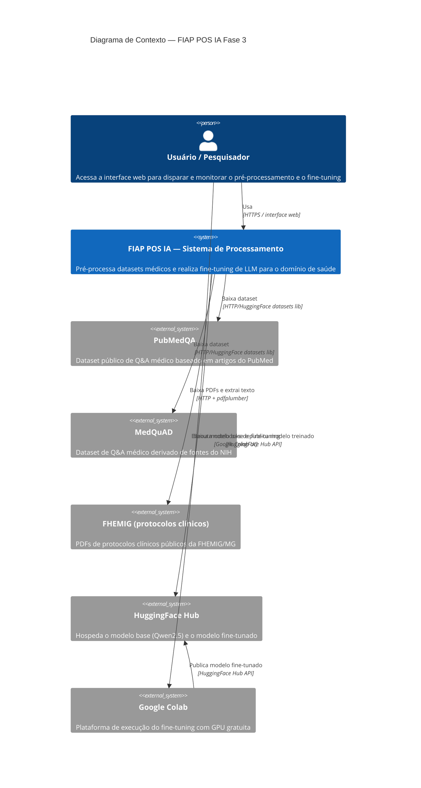
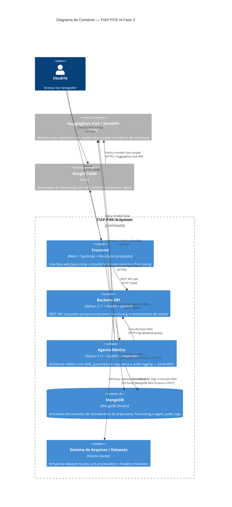
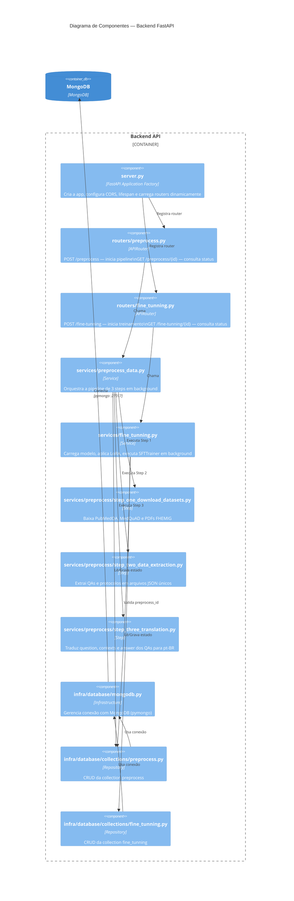
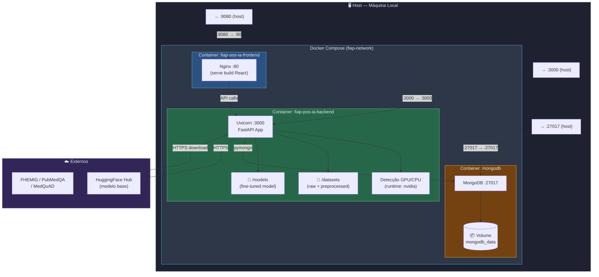
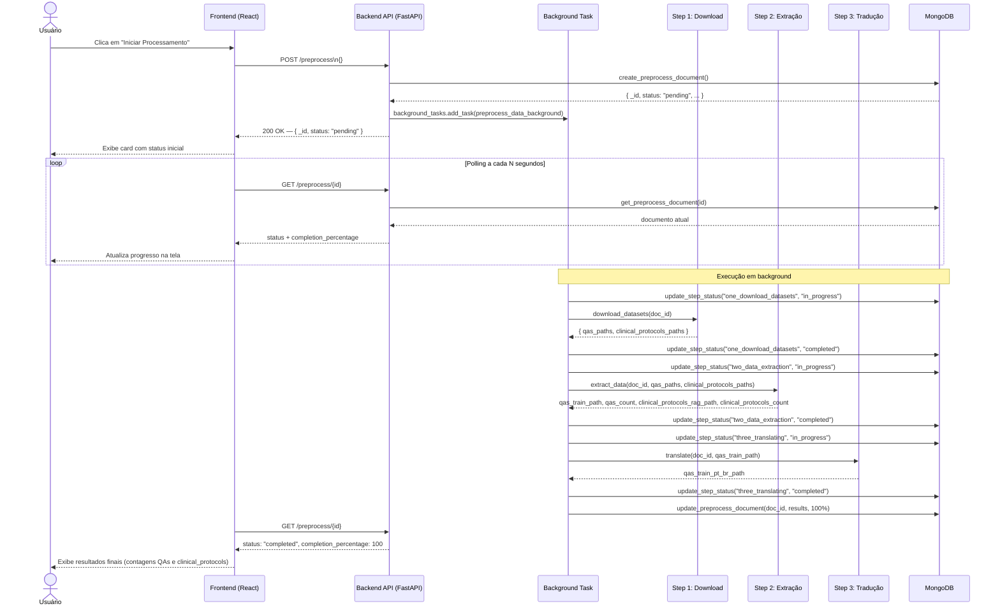
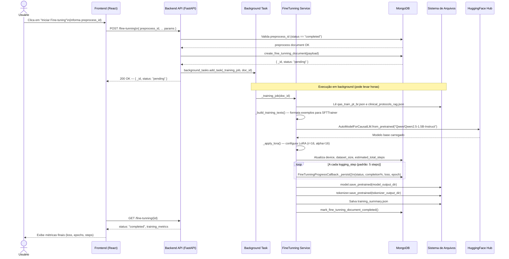
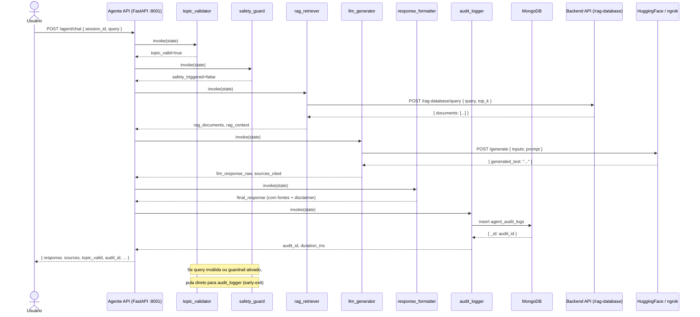

# Documentação de Arquitetura — FIAP POS IA Fase 3

> **Tech Challenge — Pré-processamento de Datasets Médicos e Fine-tuning de LLM**

Este documento descreve a arquitetura do sistema desenvolvido para o Tech Challenge da Fase 3 da Pós-graduação FIAP em IA para Devs. O objetivo é prover uma visão técnica abrangente — do contexto de alto nível até os componentes internos — para facilitar a compreensão, manutenção e evolução da solução.

---

## Índice

1. [Visão Geral](#visão-geral)
2. [C4 Level 1 — Diagrama de Contexto](#c4-level-1--diagrama-de-contexto)
3. [C4 Level 2 — Diagrama de Container](#c4-level-2--diagrama-de-container)
4. [C4 Level 3 — Diagrama de Componentes](#c4-level-3--diagrama-de-componentes)
5. [Diagrama de Deployment](#diagrama-de-deployment)
6. [Diagrama de Sequência — Pipeline de Pré-processamento](#diagrama-de-sequência--pipeline-de-pré-processamento)
7. [Diagrama de Sequência — Fine-tuning Local](#diagrama-de-sequência--fine-tuning-local)
8. [Decisões de Arquitetura (ADRs)](#decisões-de-arquitetura-adrs)

---

## Visão Geral

A solução é uma aplicação **full-stack** composta por quatro camadas principais:

| Camada | Tecnologia | Responsabilidade |
|---|---|---|
| **Frontend** | React + TypeScript + Vite | Interface web para iniciar e monitorar o processamento |
| **Backend** | Python + FastAPI | API REST, orquestração das pipelines de dados e fine-tuning |
| **Agente Médico** | Python + FastAPI + LangGraph | Assistente médico com RAG, guardrails de segurança e auditoria |
| **Banco de dados** | MongoDB | Persistência do estado das execuções e logs de auditoria |

O fluxo central da aplicação é:

1. O usuário acessa o frontend e inicia o pré-processamento sem parâmetros.
2. O backend recebe a requisição, cria um documento de rastreamento no MongoDB e dispara a pipeline em background.
3. A pipeline baixa os datasets (PubMedQA, MedQuAD, protocolos FHEMIG), extrai cada família em um arquivo JSON e traduz os QAs para português.
4. O usuário pode acompanhar o progresso em tempo real via polling do frontend.
5. Com os dados pré-processados, é possível iniciar o fine-tuning do modelo Qwen2.5-1.5B-Instruct diretamente pela aplicação (com GPU) ou via Jupyter Notebooks no Google Colab.

> **Nota sobre fine-tuning:** Devido a restrições de hardware local, o fine-tuning do modelo foi executado no Google Colab. O modelo treinado está disponível como repositório privado no HuggingFace. Para servir o modelo em produção, utiliza-se HuggingFace Spaces com ZeroGPU.

---

## C4 Level 1 — Diagrama de Contexto

Visão de mais alto nível: quem usa o sistema e com quais sistemas externos ele se integra.

---

## C4 Level 2 — Diagrama de Container

Detalha os containers (processos/serviços) que compõem o sistema e como se comunicam.

---

## C4 Level 3 — Diagrama de Componentes

Detalha os componentes internos do **Backend**, que é o núcleo da lógica de negócio.

---

## Diagrama de Deployment

Representa a topologia de execução em ambiente local via Docker Compose.

---

## Diagrama de Sequência — Pipeline de Pré-processamento

Fluxo completo desde a requisição do usuário até a conclusão da pipeline de 3 steps.

---

## Diagrama de Sequência — Fine-tuning Local

Fluxo do fine-tuning executado localmente via API (requer GPU).

---

## Diagrama de Sequência — Agente Médico

Fluxo completo de uma consulta ao assistente médico com o pipeline LangGraph.

---

## Decisões de Arquitetura (ADRs)

As decisões técnicas que moldaram esta arquitetura estão documentadas como **ADRs (Architecture Decision Records)** no formato MADR:

| # | Título | Status |
|---|---|---|
| [ADR-001](adr/ADR-001-modelo-base-qwen.md) | Escolha do modelo base Qwen2.5-1.5B-Instruct | ✅ Aceito |
| [ADR-002](adr/ADR-002-lora-peft-finetuning.md) | Uso de LoRA/PEFT para fine-tuning eficiente | ✅ Aceito |
| [ADR-003](adr/ADR-003-qlora-4bit-fallback-cpu.md) | QLoRA (quantização 4-bit) com fallback para CPU | ✅ Aceito |
| [ADR-004](adr/ADR-004-mongodb-estado.md) | MongoDB como banco de estado do processamento | ✅ Aceito |
| [ADR-005](adr/ADR-005-background-tasks-fastapi.md) | Processamento assíncrono via FastAPI BackgroundTasks | ✅ Aceito |
| [ADR-006](adr/ADR-006-finetuning-google-colab.md) | Fine-tuning executado no Google Colab | ✅ Aceito |
| [ADR-007](adr/ADR-007-split-train-rag.md) | Split train/RAG configurável via rag_percent | ⚠️ Substituído |
| [ADR-008](adr/ADR-008-docker-compose.md) | Orquestração local via Docker Compose | ✅ Aceito |
| [ADR-009](adr/ADR-009-deteccao-gpu-cpu.md) | Detecção automática GPU/CPU no backend | ✅ Aceito |
| [ADR-010](adr/ADR-010-colab-ngrok-zerogpu.md) | Colab + ngrok e HuggingFace ZeroGPU para servir o modelo | ✅ Aceito |
| [ADR-011](adr/ADR-011-langgraph-medical-agent.md) | LangGraph como orquestrador do agente médico | ✅ Aceito |
