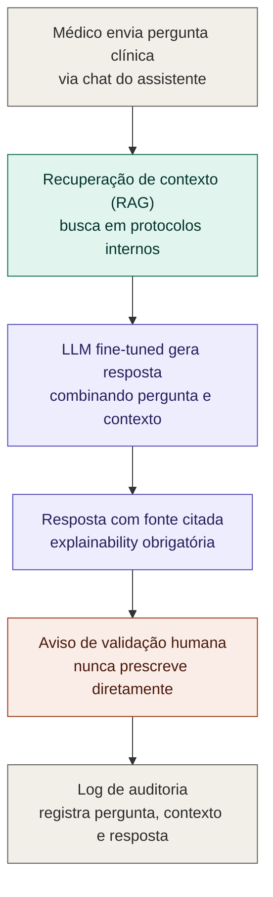
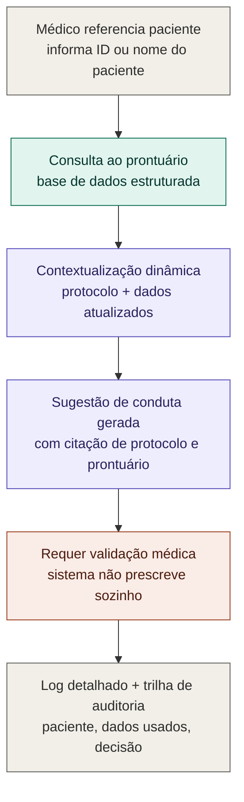
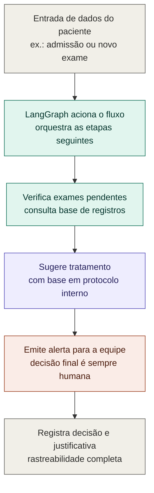

# Jornadas de usuário — Assistente médico (LangChain)

> Referência: Tech Challenge Fase 3, item 2 dos **Requisitos obrigatórios** — "Criação de assistente médico com LangChain". Os fluxos abaixo também incorporam as salvaguardas do item 3 (nunca prescrever diretamente, logging detalhado, explainability).

Este documento descreve três jornadas de uso que, juntas, cobrem os três sub-requisitos do item 2:

1. pipeline que integra a LLM customizada (fine-tuned);
2. consultas em base de dados estruturada (prontuários/registros);
3. contextualização das respostas com informações atualizadas do paciente — incluindo o fluxo automatizado citado no desafio (verificação de exames pendentes, sugestão de tratamento, alertas à equipe).

---

## Jornada 1 — Dúvida clínica pontual (Q&A com protocolos internos)

Cenário mais simples: o médico quer tirar uma dúvida de conduta, sem vincular a pergunta a um paciente específico. Cobre a integração básica da LLM fine-tuned via LangChain (RAG sobre protocolos).

**Etapas:**

1. **Médico envia pergunta clínica** — via chat do assistente.
2. **Recuperação de contexto (RAG)** — busca nos protocolos internos do hospital.
3. **LLM fine-tuned gera resposta** — combina a pergunta com o contexto recuperado.
4. **Resposta com fonte citada** — indica de qual protocolo/documento veio a informação (explainability).
5. **Aviso de validação humana** — reforça que o assistente nunca prescreve diretamente.
6. **Log de auditoria** — registra pergunta, contexto usado e resposta gerada.

**Exemplos de prompts:**

- "Qual o protocolo do hospital para dor torácica aguda?"
- "Quais são as contraindicações do protocolo de sedação para procedimentos ambulatoriais?"
- "Qual a dose máxima recomendada de X segundo nosso protocolo interno?"
- "Existe um protocolo específico para manejo de sepse na nossa UTI?"
- "Quais exames o protocolo recomenda antes de iniciar anticoagulação?"

---

## Jornada 2 — Consulta contextualizada por paciente

Cobre os sub-requisitos "realizar consultas em base de dados estruturadas" e "contextualizar as respostas da LLM com informações atualizadas do paciente". O médico referencia um paciente específico e o sistema cruza protocolo + prontuário.

**Etapas:**

1. **Médico referencia paciente** — informa ID ou nome do paciente na conversa.
2. **Consulta ao prontuário** — LangChain busca dados na base estruturada (registros, exames, histórico).
3. **Contextualização dinâmica** — combina o protocolo clínico com os dados atualizados do paciente.
4. **Sugestão de conduta gerada** — resposta cita tanto o protocolo quanto os dados do prontuário usados.
5. **Requer validação médica** — o sistema nunca prescreve ou age sozinho; a decisão final é humana.
6. **Log detalhado + trilha de auditoria** — registra paciente, dados consultados e decisão sugerida.

**Exemplos de prompts:**

- "O paciente 12345 pode receber o protocolo de anticoagulação, considerando os exames dele?"
- "Quais são os últimos resultados de função renal do paciente Maria Silva e isso muda a dose recomendada?"
- "O histórico do paciente 98421 tem alguma contraindicação para o protocolo de sedação?"
- "Baseado no prontuário do leito 305, o protocolo de sepse ainda se aplica?"
- "O paciente João tem alergias registradas que conflitem com o tratamento sugerido pelo protocolo X?"

---

## Jornada 3 — Fluxo automatizado de decisão (LangGraph)

Cobre o cenário citado no desafio: "ao receber informações sobre um paciente, o sistema pode acionar diferentes etapas, como verificar exames pendentes, sugerir tratamentos e emitir alertas para a equipe médica". Diferente das jornadas 1 e 2, aqui o fluxo é disparado por um evento (ex.: admissão, novo exame lançado), não por uma pergunta direta do médico.

**Etapas:**

1. **Entrada de dados do paciente** — evento de gatilho, ex.: admissão ou lançamento de novo exame.
2. **LangGraph aciona o fluxo** — orquestra os nós de decisão subsequentes.
3. **Verifica exames pendentes** — consulta a base de registros do paciente.
4. **Sugere tratamento** — com base nos protocolos internos do hospital.
5. **Emite alerta para a equipe médica** — a decisão final permanece sempre humana.
6. **Registra decisão e justificativa** — garante rastreabilidade completa para auditoria.

**Exemplos de prompts (disparados por evento):**

- (Admissão) "Paciente admitido com suspeita de AVC — quais etapas o sistema deve verificar automaticamente?"
- (Novo exame lançado) "Novo hemograma do paciente 456 indica alteração crítica — o sistema deve alertar a equipe?"
- (Prescrição pendente) "Existem exames pendentes antes de liberar o protocolo de cirurgia para o paciente Y?"
- (Mudança de sinais vitais) "Paciente da UTI apresentou queda de saturação — quais alertas e sugestões o fluxo deve gerar?"
- (Alta hospitalar) "Antes da alta do paciente Z, o sistema deve verificar pendências de exames ou reavaliação de protocolo?"

---

## Salvaguardas transversais (item 3 do edital)

As três jornadas compartilham os mesmos "trilhos" de segurança, que devem ser implementados como componentes comuns do pipeline, e não replicados em cada fluxo:

- **Sem prescrição direta** — o assistente sempre sugere, nunca executa ou prescreve sem validação humana.
- **Explainability** — toda resposta deve indicar a fonte da informação (protocolo, prontuário, documento).
- **Logging detalhado** — cada interação é registrada para rastreamento e auditoria (pergunta/evento, contexto usado, resposta/decisão gerada).

## Mapeamento com o estado atual do projeto

| Jornada | O que já existe | O que falta implementar |
|---|---|---|
| 1 — Q&A pontual | Modelo fine-tuned (`hospital-helper-qwen2.5-1.5b`) e `app.py` servindo respostas | RAG sobre protocolos + etapa de citação de fonte |
| 2 — Consulta por paciente | — | Integração LangChain com base de prontuários estruturada |
| 3 — Fluxo automatizado | — | Orquestração via LangGraph disparada por eventos |
