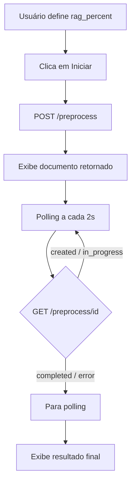

# FIAP POS IA — Frontend

Interface web em **React** + **TypeScript** (Vite) para iniciar e acompanhar o pré-processamento dos datasets médicos **PubMedQA** e **MedQuAD** via API REST do backend. O progresso de cada execução é exibido em tempo real com polling automático.

## Sumário

- [Visão geral](#visão-geral)
- [Arquitetura](#arquitetura)
- [Pré-requisitos](#pré-requisitos)
- [Configuração](#configuração)
- [Como subir a aplicação](#como-subir-a-aplicação)
- [Fluxo da interface](#fluxo-da-interface)
- [Integração com a API](#integração-com-a-api)
- [Estrutura do projeto](#estrutura-do-projeto)

---

## Visão geral

O frontend expõe uma interface para:

1. **Configurar o percentual RAG** — define quanto do dataset MedQuAD será destinado ao conjunto RAG (0.0 a 1.0).
2. **Iniciar o pré-processamento** — dispara `POST /preprocess` no backend e exibe o documento retornado.
3. **Acompanhar o progresso** — consulta `GET /preprocess/{id}` a cada 2 segundos até a conclusão, mostrando status, contadores de dados e barra de progresso.

A aplicação é uma SPA (Single Page Application) servida pelo Vite em desenvolvimento e pelo **nginx** em produção (Docker).

---

## Arquitetura

```
src/
├── main.tsx                 # Ponto de entrada React
├── App.tsx                  # Roteamento por menu (sidebar)
├── components/
│   └── Layout.tsx           # Sidebar e área de conteúdo
├── pages/
│   └── PreProcessingPage.tsx   # Tela de pré-processamento
├── api/
│   ├── client.ts            # Cliente HTTP (fetch + tratamento de erros)
│   └── preprocess.ts        # POST /preprocess, GET /preprocess/{id}
├── hooks/
│   └── usePreprocessPolling.ts  # Polling a cada 2s até status terminal
└── types/
    └── preprocess.ts        # Tipos e status terminais
```

A comunicação com o backend é feita via `fetch` nativo. A URL base da API é configurada pela variável `VITE_BACKEND_URL` (injetada em build time pelo Vite).

---

## Pré-requisitos

| Requisito | Versão mínima | Observação |
|-----------|---------------|------------|
| Node.js | 20+ | Usado no Dockerfile |
| npm | — | Gerenciador de dependências do projeto |
| Backend | — | API FastAPI rodando (veja [`backend/README.md`](../backend/README.md)) |

Para desenvolvimento local, também é útil ter **Docker** e **Docker Compose** (veja [Como subir a aplicação](#como-subir-a-aplicação)).

### Dependências npm

Definidas em `package.json`:

| Pacote | Uso |
|--------|-----|
| `react` / `react-dom` | Interface de usuário |
| `vite` | Bundler e dev server |
| `@vitejs/plugin-react` | Suporte a React no Vite |
| `typescript` | Tipagem estática |

---

## Configuração

Copie o arquivo de exemplo e ajuste conforme seu ambiente:

```bash
cp .env.example .env
```

| Variável | Descrição | Padrão |
|----------|-----------|--------|
| `VITE_BACKEND_URL` | URL base da API do backend | `http://localhost:3000` |

> **Nota:** Variáveis `VITE_*` são embutidas no bundle no momento do build. Ao usar Docker, o valor é passado como `ARG` no `Dockerfile` via `app-docker-compose.yaml`. Para alterar a URL da API em produção, é necessário **rebuild** da imagem.

---

## Como subir a aplicação

### Opção 1 — Docker Compose (recomendado)

Na raiz do repositório, suba frontend, backend e MongoDB juntos:

```bash
docker compose -f app-docker-compose.yaml up --build -d
```

Para reiniciar os containers:

```bash
./restart-app.sh
```

| Serviço | URL |
|---------|-----|
| Frontend | `http://localhost:8080` |
| Backend (API) | `http://localhost:3000` |

### Opção 2 — Desenvolvimento local

1. Garanta que o **backend** está rodando em `http://localhost:3000` (veja [`backend/README.md`](../backend/README.md)).

2. Instale as dependências:

   ```bash
   cd frontend
   npm install
   ```

3. Configure o `.env` (se ainda não existir):

   ```bash
   cp .env.example .env
   ```

4. Inicie o dev server:

   ```bash
   npm run dev
   ```

5. Acesse a aplicação em [http://localhost:5173](http://localhost:5173).

### Build de produção (local)

```bash
npm run build
npm run preview
```

O comando `preview` serve os arquivos estáticos gerados em `dist/` (por padrão na porta 4173).

---

## Fluxo da interface

Quando o usuário clica em **Iniciar preprocessamento**, a seguinte sequência ocorre:



**Elementos da tela Pre Processing:**

| Elemento | Descrição |
|----------|-----------|
| Slider RAG percent | Percentual MedQuAD destinado ao RAG (0.00 a 1.00) |
| Botão Iniciar | Dispara o pré-processamento no backend |
| Botão Limpar | Reseta o estado da tela para nova execução |
| Status badge | `created`, `in_progress` ou `completed` |
| Contadores | `train_data` e `rag_data` formatados em pt-BR |
| Barra de progresso | `completion_percentage` (0–100%) |
| Resposta da API | JSON bruto retornado pelo backend |

---

## Integração com a API

O frontend consome os mesmos endpoints documentados no [`backend/README.md`](../backend/README.md):

| Método | Endpoint | Uso no frontend |
|--------|----------|-----------------|
| `POST` | `/preprocess/` | `startPreprocess()` — inicia execução |
| `GET` | `/preprocess/{id}` | `getPreprocessStatus()` — polling de progresso |

**Tratamento de erros:** respostas HTTP com status de erro são convertidas em mensagens legíveis a partir do campo `detail` retornado pelo FastAPI.

**Status terminais** (polling encerra automaticamente):

| Status | Significado |
|--------|-------------|
| `completed` | Processamento concluído com sucesso |
| `error` | Falha no processamento |

---

## Estrutura do projeto

```
frontend/
├── Dockerfile              # Build multi-stage (Node + nginx)
├── nginx.conf              # Configuração SPA (fallback para index.html)
├── package.json            # Dependências e scripts
├── package-lock.json
├── .env.example            # Template de variáveis de ambiente
├── vite.config.ts          # Vite (porta 5173, host true)
├── tsconfig.json
├── index.html
└── src/
    ├── main.tsx
    ├── App.tsx
    ├── components/
    ├── pages/
    ├── api/
    ├── hooks/
    └── types/
```
