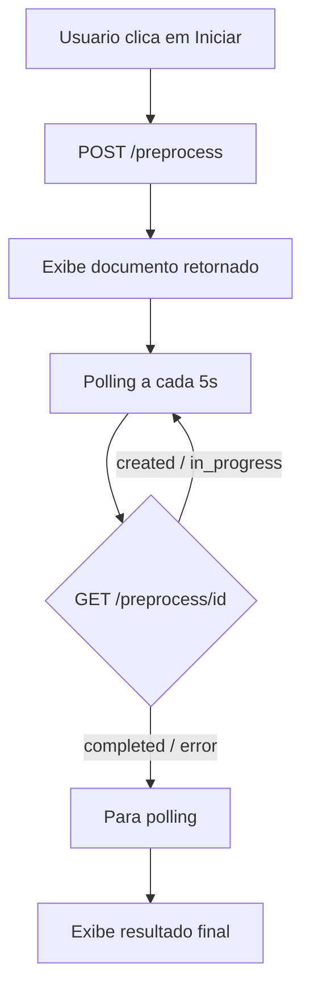
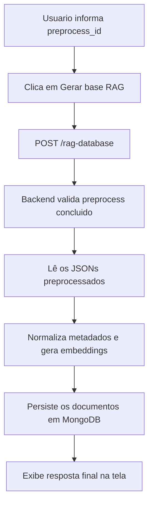
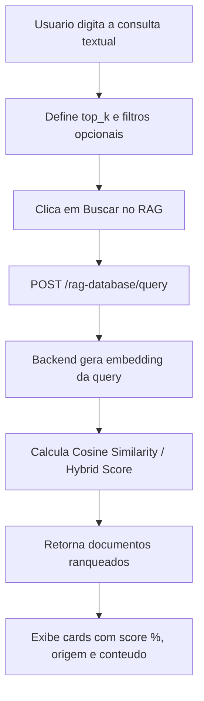

# FIAP POS IA - Frontend

Interface web em React + TypeScript (Vite) para iniciar e acompanhar o pre-processamento dos datasets medicos via API REST do backend. A tela principal mostra o progresso em tempo real com polling automatico.

## Sumario

- Visao geral
- Arquitetura
- Pre-requisitos
- Configuracao
- Como subir a aplicacao
- Fluxo da interface
- Integracao com a API
- Estrutura do projeto

## Visao geral

O frontend permite:

1. iniciar o pré-processamento de QAs (PubMedQA, MedQuAD), protocolos clínicos (FHEMIG e PCDT) e dados médicos estruturados;
2. acompanhar o progresso com polling a cada 5 segundos;
3. visualizar os resultados separados para `QAs`, `clinical_protocols` e `laudos_medicos` quando disponíveis;
4. gerar a base RAG a partir de um pré-processamento concluído;
5. realizar consultas semânticas por similaridade na base RAG (RAG Query).

A aplicacao e uma SPA servida pelo Vite em desenvolvimento e pelo nginx em producao.

## Arquitetura

```text
src/
|-- main.tsx
|-- App.tsx
|-- components/
|   `-- Layout.tsx
|-- pages/
|   |-- PreProcessingPage.tsx
|   |-- RagGenerationPage.tsx
|   `-- RagQueryPage.tsx
|-- api/
|   |-- client.ts
|   |-- preprocess.ts
|   |-- fineTuning.ts
|   `-- ragDatabase.ts
|-- hooks/
|   `-- usePreprocessPolling.ts
`-- types/
    |-- preprocess.ts
    |-- fineTuning.ts
    `-- ragDatabase.ts
```


## Pre-requisitos

| Requisito | Versao minima | Observacao |
|-----------|---------------|------------|
| Node.js | 20+ | Usado no Dockerfile |
| npm | - | Gerenciador de dependencias |
| Backend | - | API FastAPI rodando em `http://localhost:3000` |

### Dependencias npm

Definidas em `package.json`:

| Pacote | Uso |
|--------|-----|
| `react` / `react-dom` | Interface de usuario |
| `vite` | Bundler e dev server |
| `@vitejs/plugin-react` | Suporte a React no Vite |
| `typescript` | Tipagem estatica |

## Configuracao

Copie o arquivo de exemplo e ajuste conforme seu ambiente:

```bash
cp .env.example .env
```

| Variavel | Descricao | Padrao |
|----------|-----------|--------|
| `VITE_BACKEND_URL` | URL base da API do backend | `http://localhost:3000` |

## Como subir a aplicacao

### Opcao 1 - Docker Compose

```bash
docker compose -f app-docker-compose.yaml up --build -d
```

Servicos:

- Frontend: `http://localhost:8080`
- Backend: `http://localhost:3000`

### Opcao 2 - Desenvolvimento local

1. Garanta que o backend esteja rodando.
2. Instale as dependencias:

   ```bash
   cd frontend
   npm install
   ```

3. Inicie o dev server:

   ```bash
   npm run dev
   ```

4. Acesse a aplicacao em `http://localhost:5173`.

### Build de producao

```bash
npm run build
npm run preview
```

## Fluxo da interface

Quando o usuario clica em Iniciar preprocessamento:



### Elementos da tela

| Elemento | Descricao |
|----------|-----------|
| Botao Iniciar | Dispara o preprocessamento |
| Botao Limpar | Reseta o estado da tela |
| Checkbox Pular Tradução | Envia `skip_translation: true` para a API, pulando a etapa demorada de tradução |
| Status badge | Mostra o status atual da execucao |
| Contadores | Exibe `qas_count` e `clinical_protocols_count` em pt-BR |
| Barra de progresso | Mostra `completion_percentage` |
| Resposta da API | JSON bruto retornado pelo backend |

**Aviso sobre a Tradução de QAs**: A tradução dos dados de QAs é extremamente demorada e não roda em todos os hardwares que temos. Por isso, foi implementada a opção de pular essa etapa na interface, utilizando o dataset já traduzido que está fixado na pasta `backend/datasets/preprocessed/fixed/qas`.

## Integracao com a API

O frontend consome os endpoints do backend:

| Metodo | Endpoint | Uso |
|--------|----------|-----|
| `POST` | `/preprocess/` | Inicia a execucao do pre-processamento |
| `GET` | `/preprocess/{id}` | Faz polling de progresso do pre-processamento |
| `POST` | `/fine-tunning/` | Inicia a execucao do fine-tuning |
| `GET` | `/fine-tunning/{id}` | Faz polling de progresso do fine-tuning |
| `POST` | `/rag-database/` | Gera a base RAG de forma sincrona |
| `POST` | `/rag-database/query` | Realiza consultas semanticas por similaridade vetorial |

### Status terminais

O polling encerra automaticamente quando a execucao atinge um status terminal.

| Status | Significado |
|--------|-------------|
| `completed` | Processamento concluido com sucesso |
| `error` | Falha no processamento |

## Estrutura do projeto

```text
frontend/
|-- Dockerfile
|-- nginx.conf
|-- package.json
|-- package-lock.json
|-- .env.example
|-- vite.config.ts
|-- index.html
`-- src/
```

## RAG Generation

O frontend contem a tela de `RAG Generation`, que faz uma chamada sincrona para `POST /rag-database/`.

### Fluxo



### Elementos da tela de RAG Generation

| Elemento | Descricao |
|----------|-----------|
| Campo ID | Recebe o `preprocess_id` concluido |
| Botao Gerar base RAG | Dispara a geracao sincrona |
| Botao Limpar | Reseta o formulario e a resposta |
| Resumo final | Mostra `batch_id`, contagens e modelo usado |
| Resposta da API | JSON bruto retornado pelo backend |

## RAG Query

O frontend inclui a tela de `RAG Query`, permitindo aos usuarios realizarem consultas semanticas por similaridade na base de conhecimento RAG via `POST /rag-database/query`.

### Fluxo



### Elementos da tela de RAG Query

| Elemento | Descricao |
|----------|-----------|
| Campo Consulta | Recebe o texto da pergunta ou termo medico (obrigatorio) |
| Seletor top_k | Quantidade maxima de documentos a retornar (padrao: 5) |
| Filtro Preprocess ID | Limita a busca a um preprocessamento especifico (opcional) |
| Filtro Threshold | Filtra documentos com score minimo de similaridade (opcional) |
| Cards de Resultados | Exibe badges de dataset (`QAs` / `Protocolo`), score %, origem e texto completo |
| Visualizador JSON | Bloco expansivel para inspecionar o JSON bruto devolvido pela API |

